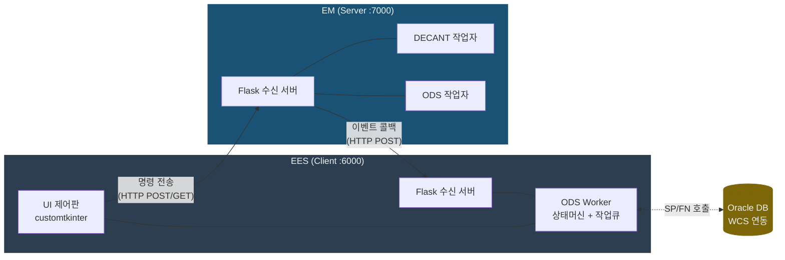
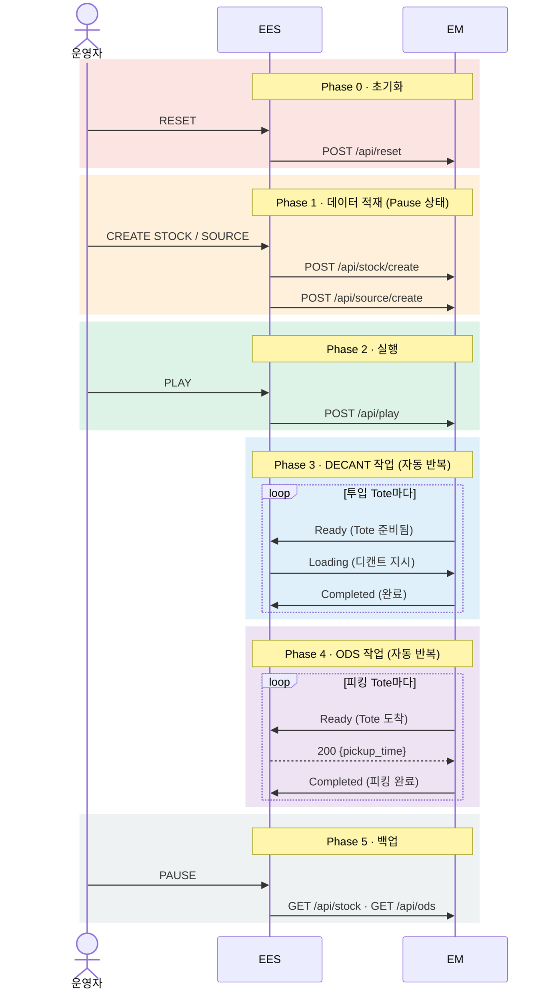
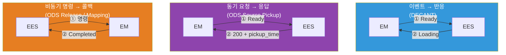
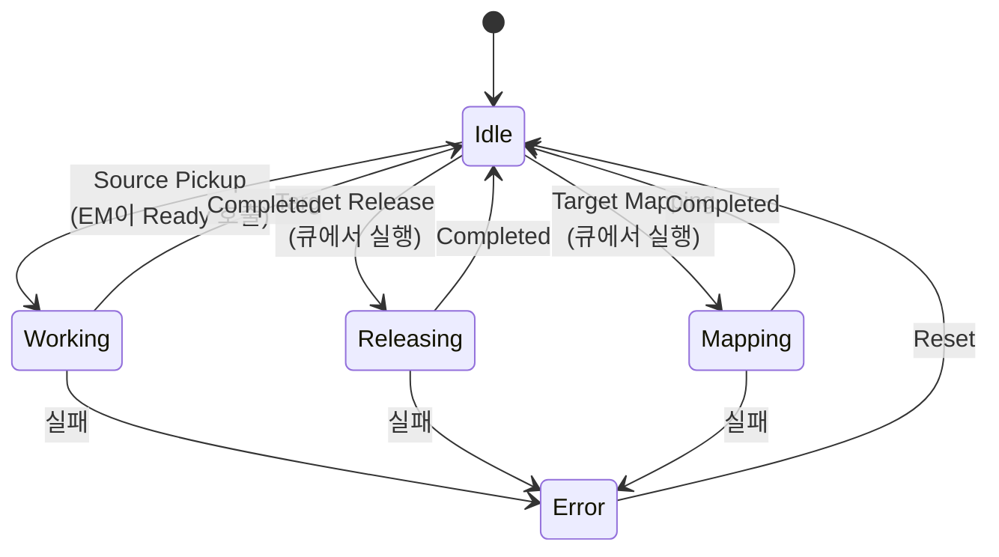
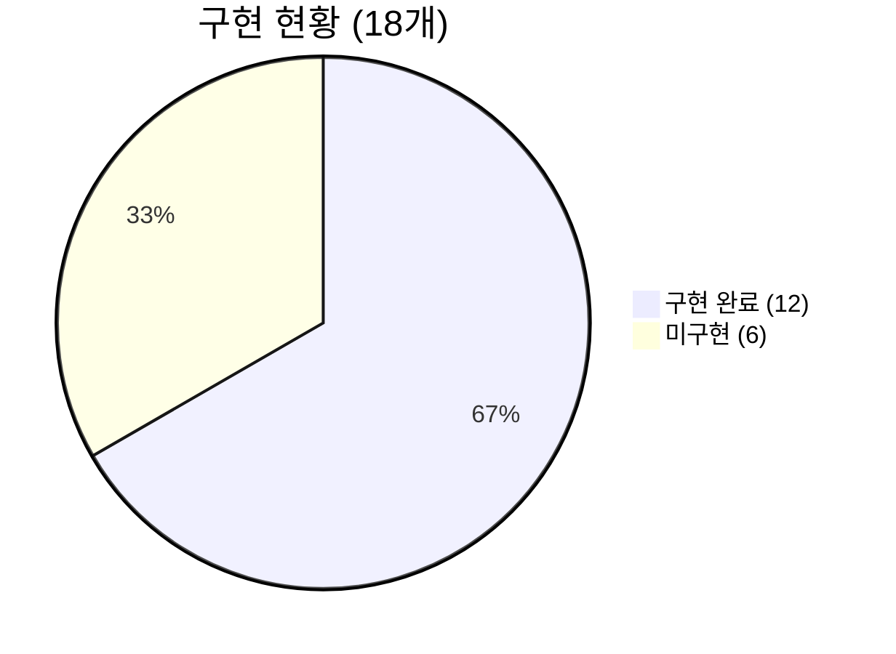

# BGF 부산 물류센터 — EES ↔ EM 시스템 설계

> 2026-02-10 | API 명세 v4 기준

---

## 1. 시스템 구조

**양방향 HTTP 통신** — EES와 EM이 각각 Flask 서버를 운영하며, 서로에게 HTTP 요청을 보내는 구조

| 구성요소 | 역할 |
|:---|:---|
| **EES** | 설비 제어 클라이언트 — 명령 전송 + 이벤트 수신 + DB 연동 |
| **EM** | 설비 시뮬레이터 서버 — 명령 수신 + 작업 완료 시 이벤트 콜백 |
| **Oracle DB** | WCS 연동 — 피킹 시간 조회, 토트 도착 통보 |

---

## 2. 운영 흐름 (Phase)

---

## 3. 통신 패턴

시스템은 작업 유형에 따라 **3가지 통신 패턴**을 사용합니다.

| 패턴 | 대상 | 핵심 |
|:---|:---|:---|
| **이벤트-반응** | DECANT | EM이 Ready → EES가 자동으로 Loading 역호출 |
| **동기 요청-응답** | ODS Pickup | EM이 Ready → EES가 DB 조회 후 pickup_time 응답 |
| **비동기 명령-콜백** | ODS Release/Mapping | EES가 명령 → EM이 작업 후 Completed 콜백 |

---

## 4. ODS Worker 상태 머신

각 ODS 스테이션마다 Worker 인스턴스가 **상태 머신 + 작업 큐**로 동작합니다.

- **Source Pickup** — EM 이벤트로 즉시 진입 (큐 거치지 않음)
- **Release / Mapping** — 작업 큐(deque)에 등록 후 Idle일 때 순차 실행
- **Error** — Reset으로만 해제, 큐 전체 클리어

---

## 5. API 현황

### EES → EM (12개)

| 분류 | API | 상태 |
|:---|:---|:---:|
| 제어 | Play · Pause · Reset | ✅ ✅ ✅ |
| 데이터 적재 | Create Stock · Create Source | ✅ ✅ |
| 데이터 적재 | Create Target · Create ODS | ❌ ❌ |
| DECANT | Loading DECANT Source | ✅ |
| ODS 명령 | Release ODS Target · Mapping ODS Target | ❌ ❌ |
| 백업 조회 | Backup Stock · Backup ODS | ❌ ❌ |

### EM → EES (6개) — 전체 구현 완료

| 분류 | API |
|:---|:---|
| DECANT | Ready · Completed |
| ODS | Ready · Completed Source · Completed Release · Completed Mapping |

