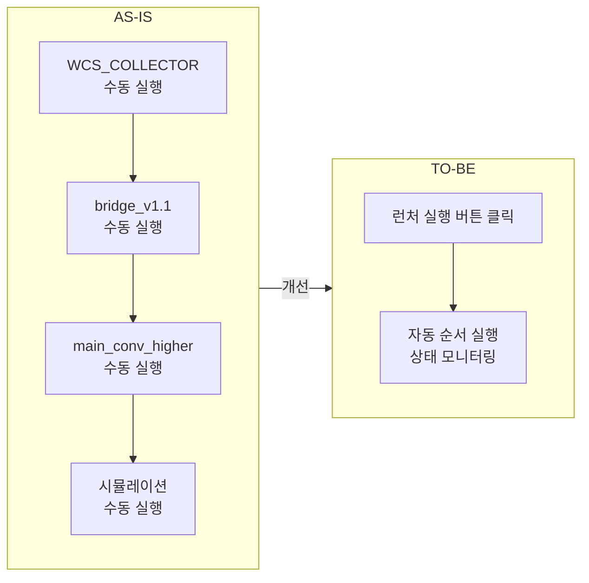
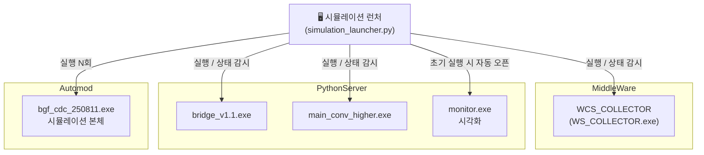
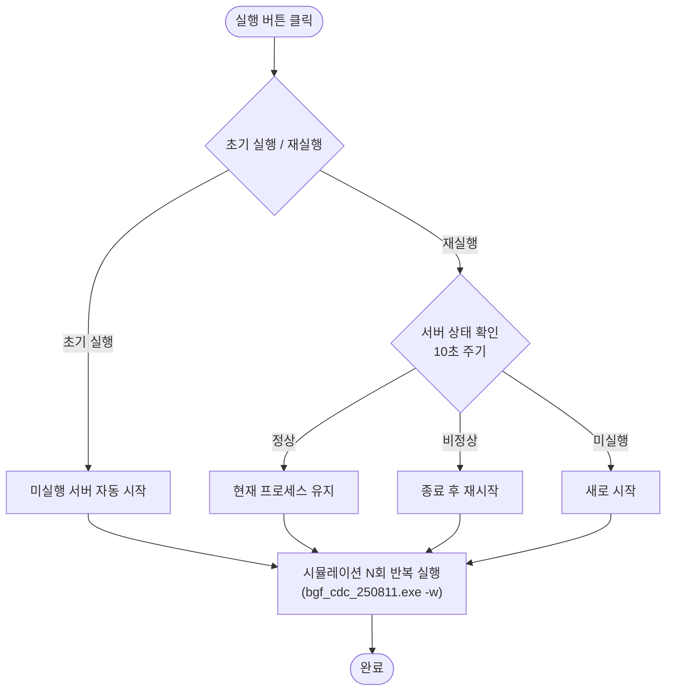
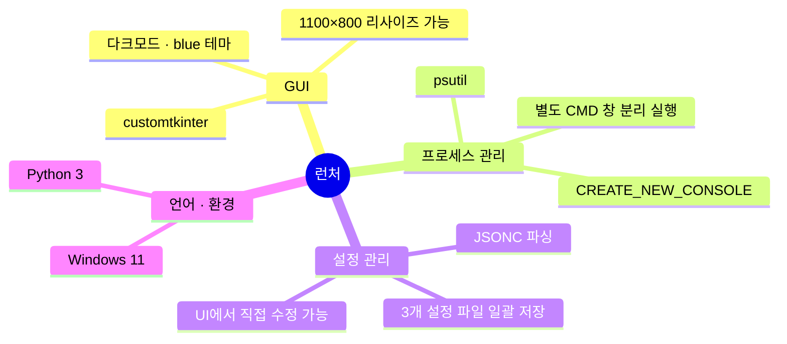

# BGF 부산 CDC 시뮬레이션 런처

---

## 1. 배경 및 목적

시뮬레이션을 실행하려면 **4개 프로세스를 정해진 순서대로 수동 실행**해야 했음.
순서를 빠뜨리거나 상태 확인이 어려운 문제 → **GUI 런처로 일원화**

---

## 2. 시스템 구성

---

## 3. 주요 기능 및 기술 스택

### 실행 흐름

### 기술 스택

---

## 4. 데모

<!-- 스크린샷 / 영상 삽입 -->
