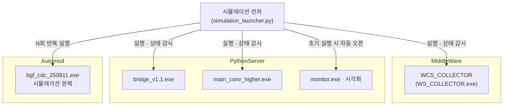

# BGF 부산 CDC 시뮬레이션 런처

---

## 1. 배경 및 목적

Automod 시뮬레이션을 실행하려면 **3개의 서버 프로세스를 정해진 순서대로 직접 켜야** 했습니다.
각 exe 파일의 위치가 다르고, 실행 순서가 틀리거나 하나를 빠뜨리면 시뮬레이션이 정상 동작하지 않는 문제가 있었습니다.
또한 반복 실험 시 시뮬레이션을 여러 번 재실행할 때마다 서버 상태를 눈으로 일일이 확인해야 했습니다.

이를 해결하기 위해 **서버 실행, 상태 확인, 시뮬레이션 반복 실행을 하나의 GUI에서 처리**하는 런처를 제작했습니다.

---

## 2. 시스템 구성

시뮬레이션 실행에 필요한 프로세스는 총 4개입니다.

각 프로세스는 서로 다른 폴더에 위치하며, 런처가 작업 디렉터리를 지정해 실행합니다.
WCS_COLLECTOR의 경우 폴더명과 exe 파일명이 달라 (`WS_COLLECTOR.exe`) 수동 실행 시 혼동이 잦았습니다.

---

## 3. 주요 기능 및 기술 스택

### 주요 기능

**초기 실행**
버튼 하나로 3개 서버를 순서대로 자동 시작하고, 시뮬레이션과 시각화 모니터를 함께 실행합니다.

**재실행**
각 서버의 상태를 확인해 정상이면 유지, 비정상이면 종료 후 재시작, 미실행 상태면 새로 시작합니다.
서버 상태는 10초 주기로 자동 갱신됩니다.

**반복 실행**
시뮬레이션을 N회 반복 실행할 수 있습니다. GUI에서 횟수를 조절하면 순차적으로 실행됩니다.

**연결 설정**
Memgraph, RabbitMQ, Oracle 접속 정보를 GUI에서 직접 수정할 수 있습니다.
저장 시 관련 설정 파일 3개에 일괄 반영됩니다.

### 기술 스택

| 항목 | 내용 |
|------|------|
| 언어 | Python 3 |
| GUI 프레임워크 | customtkinter (다크 모드, blue 테마) |
| 프로세스 관리 | psutil + CREATE_NEW_CONSOLE (각 서버를 별도 CMD 창으로 분리) |
| 설정 파일 | JSONC 형식 파싱, 3개 파일 일괄 저장 |

---

## 4. 데모

<!-- 스크린샷 / 영상 삽입 -->
