# BGF CDC 시뮬레이션 환경 구축
### WCS/WES SP 분석 및 자동 출고 시뮬 설계

> **작업 기간:** 2026-04-08 ~ 2026-04-14
> **대상 시스템:** BGF 부산 물류센터(CDC) WCS/WES

---

## 1. 목표

**SP_TSK_CORE_MATCH_TOTE_ORDER_PRC** (이하 SP_MATCH_TOTE) 를 활용하여
MSC(자동창고 크레인)의 출고 오더 생성 흐름을 시뮬레이션하고,
**연속 반복 실행 가능한 시뮬레이션 환경**을 구축한다.

---

## 2. 시스템 구조

### 2-1. 설비 흐름

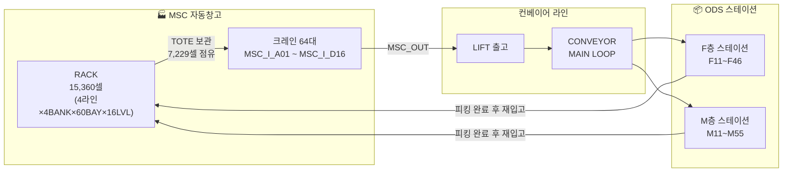

### 2-2. 핵심 데이터 원본

| 테이블 | 출처 | 행 수 | 역할 |
|--------|------|------:|------|
| `TOTE_MAPPING` | BGF_CDC → CTAS 복사 | 102,276 | 출고 대상 TOTE-스테이션 매핑 |
| `TOTE_INVENTORY` | BGF_CDC → CTAS 복사 | 9,295 | MSC 창고 실제 재고 현황 |

---

## 3. 시뮬레이션 전체 실행 구조

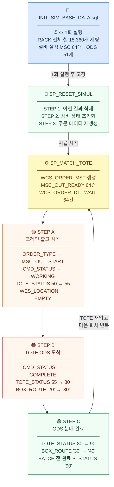

---

## 4. 구축 작업 상세

### 4-1. SP_RESET_SIMUL — 시뮬 초기화 프로시저

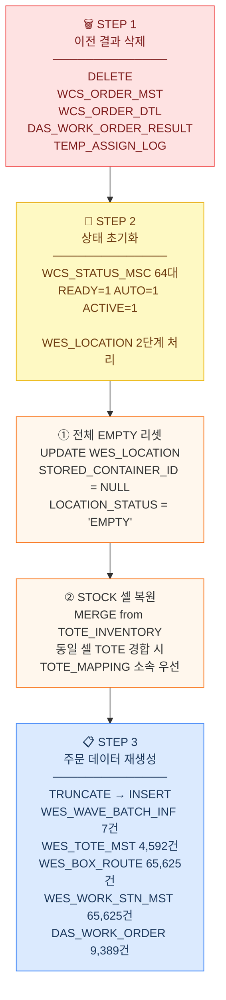

> **성능 개선 포인트:** STEP 3 기존 `DELETE` → `EXECUTE IMMEDIATE 'TRUNCATE TABLE'` 교체
> WES_BOX_ROUTE 65,625건 DELETE 시 수 분 소요 → TRUNCATE로 즉시 완료

### 4-2. INIT_SIM_BASE_DATA.sql — WES_LOCATION RACK 전체 셀

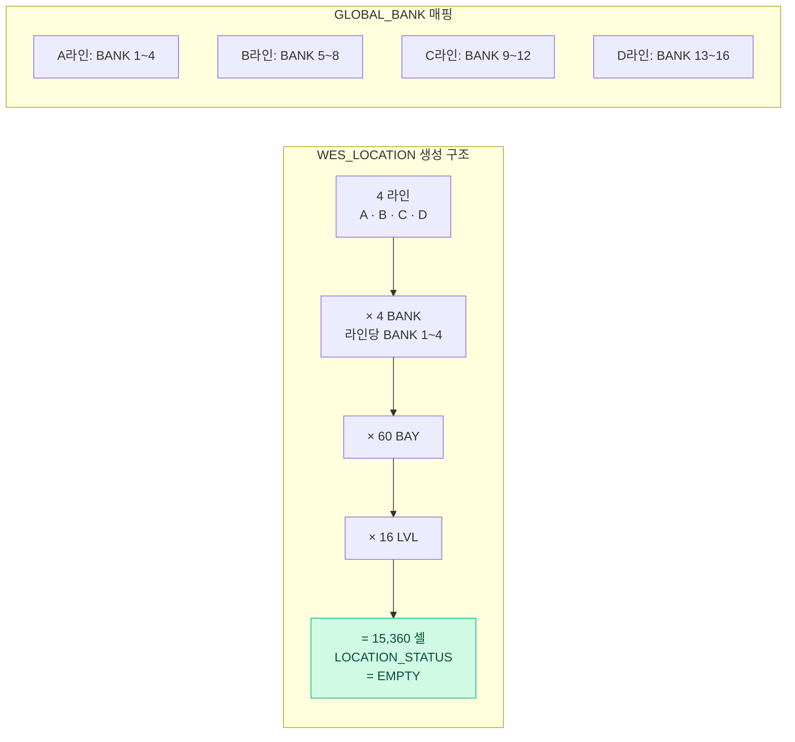

**LOCATION_ID 규칙:** `MSC_I.{GLOBAL_BANK}.{BAY}.{LVL}`
**예시:** A라인 BANK2, BAY5, LVL3 → `MSC_I.2.5.3`

| 테이블 | 건수 | 내용 |
|--------|-----:|------|
| `WES_BASE_STN_MST` | 51 | ODS 스테이션 (F층/M층) |
| `WCS_CFG_EQP_ID` | 64 | 크레인 설비 MSC_I_A01 ~ D16 |
| `WES_CFG_DEACTIVE` | 68 | MSC 64 + LIF_OUT 4 |
| `WCS_CFG_CV_SETTING` | 4 | 컨베이어 MAIN LOOP (A~D) |
| `WCS_CFG_LIMIT_CNT` | 2 | 스테이션 부하 제한 (F/M, LIMIT=10) |
| `WCS_STATUS_MSC` | 64 | 크레인 초기 정상 상태 |

---

## 5. 트러블슈팅

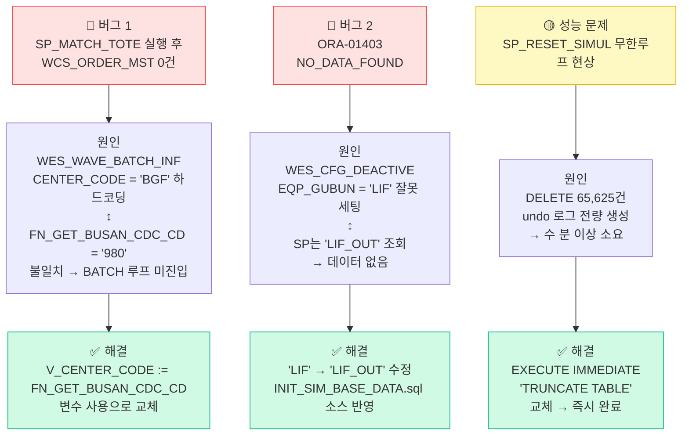

---

## 6. SP_MATCH_TOTE 동작 원리

### 오더 생성 판단 흐름 (Pass 조건 3가지)

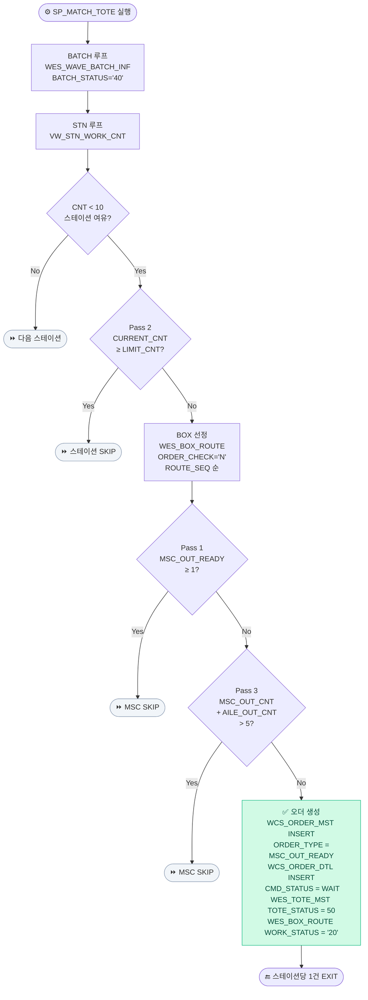

**실행 결과 (정상 동작 확인)**

| 테이블 | 건수 | 값 |
|--------|-----:|-----|
| `WCS_ORDER_MST` | **64건** | ORDER_TYPE = MSC_OUT_READY |
| `WCS_ORDER_DTL` | **64건** | CMD_STATUS = WAIT |

---

## 7. 시뮬레이션 단계 설계

### TOTE 상태 전이

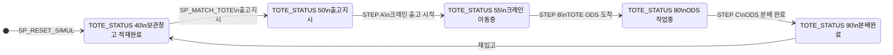

### BOX_ROUTE · CMD_STATUS 상태 전이

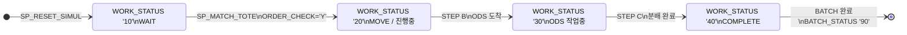

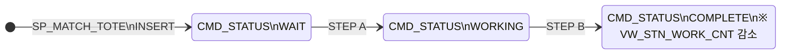

### 단계별 업데이트 테이블

| 단계 | 대상 테이블 | 변경 컬럼 | 변경 값 |
|:----:|------------|----------|---------|
| **STEP A** | `WCS_ORDER_MST` | ORDER_TYPE | `MSC_OUT_READY` → `MSC_OUT_START` |
| **STEP A** | `WCS_ORDER_DTL` | CMD_STATUS | `WAIT` → `WORKING` |
| **STEP A** | `WES_TOTE_MST` | TOTE_STATUS | `50` → `55` |
| **STEP A** | `WES_LOCATION` | STORED_CONTAINER_ID / LOCATION_STATUS | `NULL` / `EMPTY` |
| **STEP B** | `WCS_ORDER_DTL` | CMD_STATUS | `WORKING` → `COMPLETE` |
| **STEP B** | `WES_TOTE_MST` | TOTE_STATUS | `55` → `80` |
| **STEP B** | `WES_BOX_ROUTE` | WORK_STATUS | `'20'` → `'30'` |
| **STEP C** | `WES_TOTE_MST` | TOTE_STATUS | `80` → `90` |
| **STEP C** | `WES_BOX_ROUTE` | WORK_STATUS | `'30'` → `'40'` |
| **STEP C** | `WES_WAVE_BATCH_INF` | BATCH_STATUS | `40` → `90` *(전 BOX 완료 시)* |

---

## 8. 담당자 질의응답 — 확정 사항

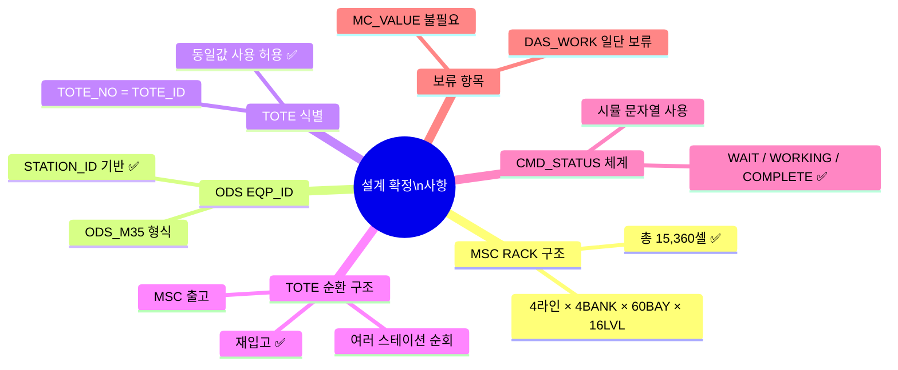

---

## 9. 현재 상태 및 다음 단계

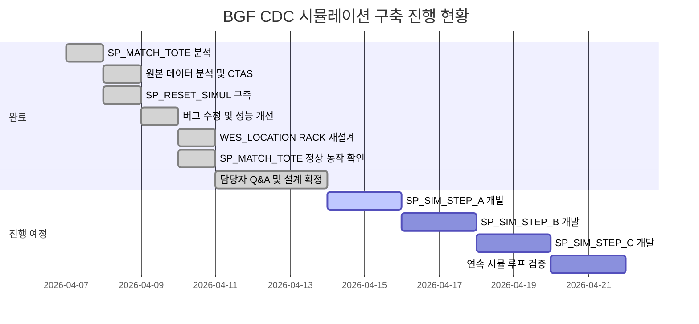

### 완료

- [x] `INIT_SIM_BASE_DATA.sql` — RACK 전체 셀 15,360개 포함 완성
- [x] `SP_RESET_SIMUL` — 3단계 초기화 정상 동작 확인
- [x] `SP_MATCH_TOTE` — 64건 오더 생성 정상 확인
- [x] 시뮬레이션 STEP A / B / C 설계 확정

### 다음 작업

- [ ] `SP_SIM_STEP_A` 개발 — 크레인 출고 시작 처리
- [ ] `SP_SIM_STEP_B` 개발 — TOTE ODS 도착 처리
- [ ] `SP_SIM_STEP_C` 개발 — ODS 분배 완료 처리
- [ ] 연속 시뮬 루프 실행 검증

---

*BGF CDC 시뮬레이션 환경 구축 — NNT 작업 내용 정리*
