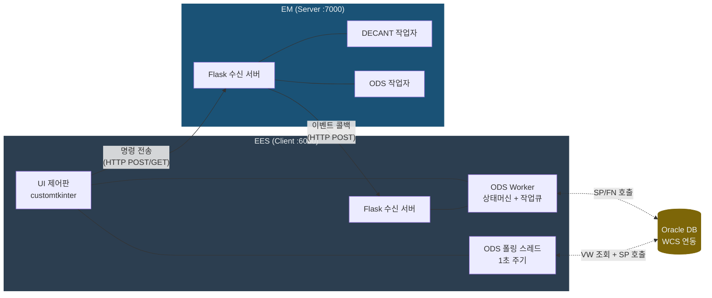
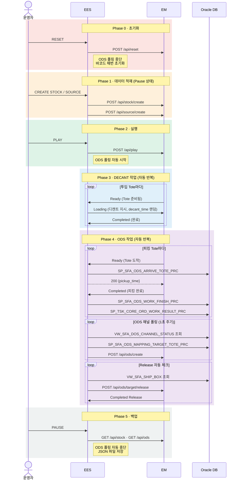
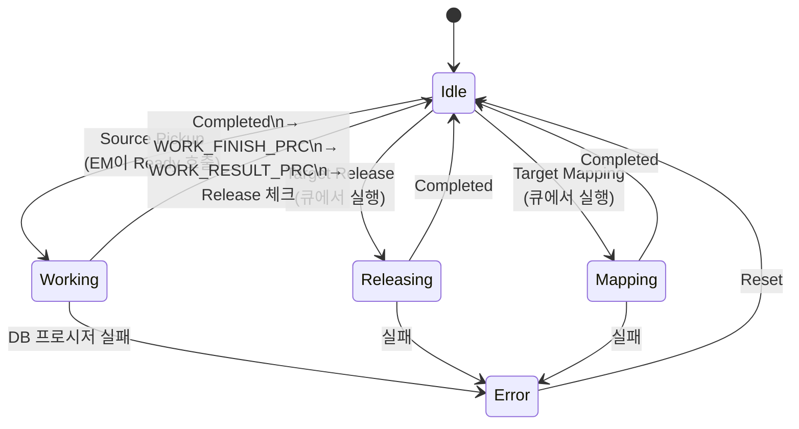
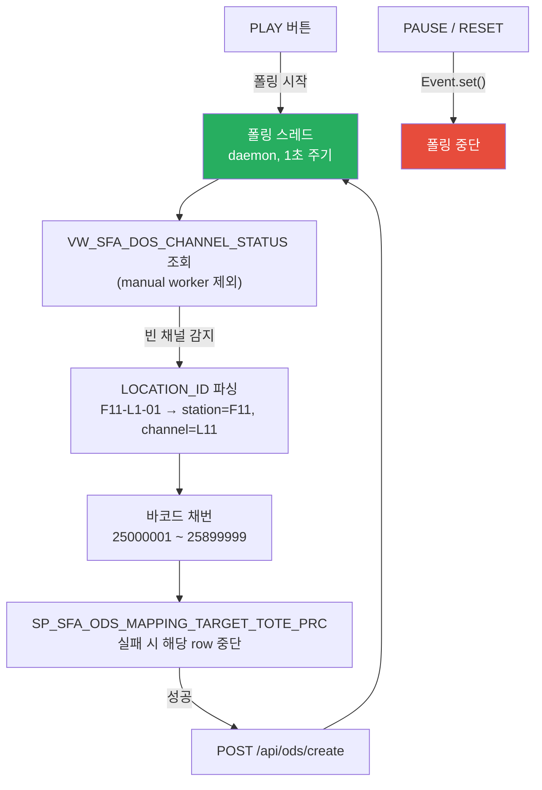
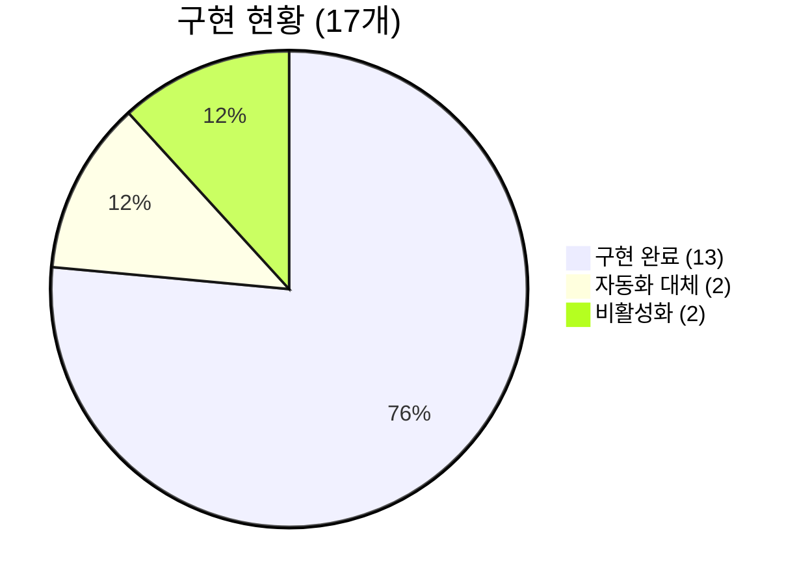

# BGF 부산 물류센터 — EES ↔ EM 시스템 설계

> 2026-02-24 | API 명세 v4 기준 · 문서 v4 (v3 대비: ODS 폴링·DB 프로시저·동시성 추가)

---

## 1. 시스템 구조



| 구성요소 | 역할 |
|:---|:---|
| **EES** | 설비 제어 클라이언트 — 명령 전송 + 이벤트 수신 + DB 연동 |
| **EM** | 설비 시뮬레이터 서버 — 명령 수신 + 작업 완료 시 이벤트 콜백 |
| **Oracle DB** | WCS 연동 — 피킹 시간 조회, 토트 도착/완료 통보, ODS 채널 상태 폴링 |

---

## 2. 운영 흐름 (Phase)



---

## 3. 통신 패턴

시스템은 작업 유형에 따라 **3가지 통신 패턴**을 사용합니다.

```mermaid
graph TB
    subgraph P1 ["이벤트 → 반응<br/>(DECANT)"]
        direction LR
        A1["EM"] -->|"① Ready"| B1["EES"]
        B1 -->|"② Loading"| A1
    end

    subgraph P2 ["동기 요청 → 응답<br/>(ODS Source Pickup)"]
        direction LR
        A2["EM"] -->|"① Ready"| B2["EES"]
        B2 -->|"② 200 + pickup_time"| A2
    end

    subgraph P3 ["비동기 명령 → 콜백<br/>(ODS Release / Mapping)"]
        direction LR
        B3["EES"] -->|"① 명령"| A3["EM"]
        A3 -->|"② Completed"| B3
    end

    subgraph P4 ["DB 폴링 → 자동 명령<br/>(ODS Create)"]
        direction LR
        D4[("Oracle DB")] -->|"① 채널 상태 감지"| B4["EES"]
        B4 -->|"② /api/ods/create"| A4["EM"]
    end

    style P1 fill:#3498db,color:#fff
    style P2 fill:#8e44ad,color:#fff
    style P3 fill:#e67e22,color:#fff
    style P4 fill:#27ae60,color:#fff
```



| 패턴 | 대상 | 핵심 |
|:---|:---|:---|
| **이벤트-반응** | DECANT | EM이 Ready → EES가 자동으로 Loading 역호출 |
| **동기 요청-응답** | ODS Pickup | EM이 Ready → EES가 DB 조회 후 pickup_time 응답 |
| **비동기 명령-콜백** | ODS Release/Mapping | EES가 명령 → EM이 작업 후 Completed 콜백 |
| **DB 폴링-자동 명령** | ODS Create | EES가 1초 주기로 DB 폴링 → 조건 충족 시 자동 명령 |

---

## 4. ODS Worker 상태 머신

각 ODS 스테이션마다 Worker 인스턴스가 **상태 머신 + 작업 큐**로 동작합니다.



### ODS Source Completed 처리 흐름 (auto worker)

```
Completed 수신
    → WORK_FINISH_PRC(station_id, barcode)   ← 작업 완료 등록
    → WORK_RESULT_PRC(station_id|barcode)     ← 작업 결과 통보
    → VW_SFA_SHIP_BOX 조회                    ← Release 대상 체크
        → 해당 station 데이터 있으면 enqueue_release()
```

- **Source Pickup** — EM 이벤트로 즉시 진입 (큐 거치지 않음)
- **Release / Mapping** — 작업 큐(deque)에 등록 후 Idle일 때 순차 실행
- **Error** — Reset으로만 해제, 큐 전체 클리어
- **auto/manual** — EM 측에서 관리, EES는 UI 체크박스로 상태만 표시

---

## 5. DB 연동 현황

### 프로시저 / 함수 호출 목록

| # | 이름 | 종류 | 호출 시점 | 실패 시 |
|:--|:---|:---|:---|:---|
| 1 | `SP_SFA_ODS_ARRIVE_TOTE_PRC` | 프로시저 | ODS Ready 수신 (on_ready_source) | 400 반환 |
| 2 | `SP_SFA_ODS_WORK_FINISH_PRC` | 프로시저 | ODS Completed 수신 (auto만) | 400 반환 |
| 3 | `SP_TSK_CORE_ORD_WORK_RESULT_PRC` | 프로시저 | WORK_FINISH 직후 (auto만), PI_PARAMS=`"station_id\|barcode"` | 400 반환 |
| 4 | `SP_SFA_ODS_MAPPING_TARGET_TOTE_PRC` | 프로시저 | ODS 폴링 시 각 row별 (채널 매핑 전) | API 중단 |
| 5 | `XX_SFA_FN_ITEM_PICK_DURATION_SEC` | 함수 | ODS Ready 수신 (auto만, pickup_time 조회) | default 5.0s |

### 조회 뷰

| 뷰 | 조회 시점 | 용도 |
|:---|:---|:---|
| `VW_SFA_DOS_CHANNEL_STATUS` | ODS 폴링 (1초 주기) | 빈 채널 감지 → ODS Create |
| `VW_SFA_SHIP_BOX` | ODS Source Completed 후 | Release 대상 체크 |
| `WES_BASE_STN_MST` | 앱 시작 시 | ODS Station ID 목록 로드 |

### 업데이트 테이블

| 테이블 | 업데이트 시점 | 변경 내용 |
|:---|:---|:---|
| `WES_SHIP_BOX_MST` | Release 큐 등록 직후 | `SHIP_TOTE_STATUS = 30` |

---

## 6. ODS 자동 폴링 구조



- **manual worker 제외**: UI 체크박스로 manual 설정된 station은 NOT IN 필터로 폴링 제외
- **바코드 채번**: `ods_barcode_seq` 카운터 (RESET 시 25000001로 초기화)
- **LOCATION_ID 파싱**: `'F11-L1-01'` → `station_id='F11'`, `channel_id='L11'`

---

## 7. API 현황

### EES → EM (12개)

| 분류 | API | 상태 |
|:---|:---|:---:|
| 제어 | Play · Pause · Reset | ✅ ✅ ✅ |
| 데이터 적재 | Create Stock · Create Source Buffer | ✅ ✅ |
| 데이터 적재 | Create Target Buffer | △ 비활성화 |
| ODS | Create ODS | ✅ 자동 폴링 |
| DECANT | Loading DECANT Source | ✅ |
| ODS 명령 | Release ODS Target | ✅ 자동 |
| ODS 명령 | Mapping ODS Target | △ 주석 처리 |
| 백업 조회 | Backup Stock · Backup ODS | ✅ ✅ |

### EM → EES (5개) — 전체 구현 완료

| 분류 | API |
|:---|:---|
| DECANT | Ready · Completed |
| ODS | Ready · Completed Source · Completed Release · Completed Mapping |



---

## 8. 동시성 설계

### Flask → Worker 스레드 안전

```
Flask Worker Thread          OdsWorker._lock (threading.Lock)
      │                             │
      ├─ on_ready_source()    ─── with self._lock: ──→ 상태 전환
      ├─ on_completed_source() ─── with self._lock: ──→ 상태 전환 + DB 호출
      ├─ on_completed_release() ── with self._lock: ──→ 상태 전환
      ├─ on_completed_mapping() ── with self._lock: ──→ 상태 전환
      └─ reset()             ─── with self._lock: ──→ 전체 초기화
```

### tkinter 로그 스레드 안전

```
Flask / Worker Thread          Main Thread (tkinter)
      │                              │
      └─ log(msg)                    │
           └─ queue.put(msg)    ──→ _process_log_queue() [10ms 주기]
                                      └─ _update_log_ui() [위젯 업데이트]
```

- Flask/Worker 스레드에서 tkinter 위젯 직접 조작 금지 → `queue.Queue` 경유
- ODS 폴링 스레드: `threading.Event` 기반 중단 신호, daemon=True
- EM API 호출 (Release/Mapping): `threading.Thread(daemon=True)` 별도 스레드


# EES 개발 현황 (2026.02.12 ~ 02.24)

---

## Slide 1. 표지

**제목**: EES(Equipment Emulation System) 개발 현황

**기간**: 2026.02.12 ~ 02.24

**핵심 성과 (3줄 요약)**
- ODS 전체 자동화 완성 — DB 폴링 기반 자동 Create/Release/Mapping
- DB 프로시저 4개 + 뷰 2개 연동 완료 (오늘 WORK_RESULT_PRC 추가)
- 동시성 안전 강화 — Lock + Queue 기반 스레드 안전 로깅 적용

---

## Slide 2. API 구현 완료 현황

### 전체 17개 중 13개 완료 (2월 9일 기준 10개 → +3개)

| 구분 | API | 이전 (02.09) | 현재 (02.24) |
|---|---|:---:|:---:|
| EES→EM | Create ODS | ❌ | ✅ 자동 폴링 |
| EES→EM | Backup Stock | ❌ | ✅ JSON 저장 |
| EES→EM | Backup ODS | ❌ | ✅ JSON 저장 |
| EES→EM | Release ODS Target | ❌ | ✅ 자동 |
| EES→EM | Mapping ODS Target | ❌ | △ 주석 (폴링 대체) |
| EES→EM | Create Target Buffer | ❌ | △ 비활성화 |
| EM→EES | 전체 5개 | ✅ | ✅ (유지) |

> ✅ 완료 13개 · △ 부분/비활성 2개 · ❌ 없음

---

## Slide 3. ODS 자동 폴링 (핵심 신규 기능)

### 구조

```
PLAY 버튼
  └─ 폴링 스레드 시작 (daemon, 1초 주기, threading.Event 기반)
       │
       ├─ VW_SFA_DOS_CHANNEL_STATUS 조회 (manual worker 제외)
       ├─ LOCATION_ID 파싱: F11-L1-01 → station=F11, channel=L11
       ├─ 바코드 채번: 25000001 ~ 25899999 (RESET 시 초기화)
       ├─ SP_SFA_ODS_MAPPING_TARGET_TOTE_PRC 호출 (row별, 실패 시 중단)
       └─ POST /api/ods/create

PAUSE / RESET
  └─ 폴링 스레드 중단 (Event.set())
```

### Release 자동 체크 (_check_release_target)

```
ODS Source Completed 수신
  └─ VW_SFA_SHIP_BOX 전체 조회
       └─ 이 station에 해당하는 row 있으면
            ├─ enqueue_release(loading_time=3~5s 랜덤)
            └─ WES_SHIP_BOX_MST UPDATE (SHIP_TOTE_STATUS=30)
```

---

## Slide 4. DB 프로시저/함수 연동 완료

### 연동 목록 (총 5개)

| # | 이름 | 호출 시점 | 실패 동작 | 추가일 |
|---|---|---|---|---|
| 1 | `SP_SFA_ODS_ARRIVE_TOTE_PRC` | ODS Ready 수신 | 400 반환 | 02.12 |
| 2 | `SP_SFA_ODS_WORK_FINISH_PRC` | ODS Completed (auto만) | 400 반환 | 02.12 |
| 3 | `SP_SFA_ODS_MAPPING_TARGET_TOTE_PRC` | ODS 폴링 row별 | API 중단 | 02.12 |
| 4 | `SP_TSK_CORE_ORD_WORK_RESULT_PRC` | WORK_FINISH 직후 (auto만) | 400 반환 | **02.24** |
| 5 | `XX_SFA_FN_ITEM_PICK_DURATION_SEC` | ODS Ready (auto, pickup_time 조회) | default 5.0s | 02.09 |

### 프로시저 파라미터 패턴

- **SP 공통**: `(IN params..., OUT cd NUMBER, OUT msg VARCHAR2)` → cd=0 성공
- **SP_TSK_CORE_ORD_WORK_RESULT_PRC**: `(PI_PARAMS VARCHAR2, PO_RS SYS_REFCURSOR, PO_PARAMS VARCHAR2)`, PI_PARAMS = `"station_id|barcode"`

---

## Slide 5. 동시성 안전 강화

### 배경
- Flask는 멀티스레드로 이벤트 수신 → Worker 상태 동시 접근 위험
- tkinter는 메인 스레드에서만 위젯 조작 가능 → Flask 스레드에서 직접 호출 불가

### 적용 내용

**① Worker Lock (threading.Lock)**

```python
# Flask 이벤트 수신 시 Worker 메서드 진입 전 항상 Lock 획득
with self._lock:
    # 상태 전환 + DB 호출 + 큐 조작 모두 Lock 내부에서 수행
```

대상: on_ready_source / on_completed_source/release/mapping / reset (5개 진입점 전체)

**② 로그 Queue (queue.Queue)**

```
Flask/Worker 스레드         Main Thread
log(msg)                      ↑
  └─ queue.put(msg)  →  _process_log_queue() (10ms 주기 after())
                              └─ _update_log_ui() → ScrolledText 위젯 업데이트
```

---

## Slide 6. UI 개선 사항

### 로그 시스템

| 항목 | 변경 전 | 변경 후 |
|---|---|---|
| 전체 LOG CLEAR | 없음 | CLEAR 버튼 추가 |
| Worker LOG CLEAR | 없음 | CLEAR 버튼 추가 (선택 worker 또는 ALL) |
| Worker 선택 ALL | 없음 | 드롭다운 ALL 옵션 — 전체 로그 시간순 병합 표시 |
| ALL 선택 시 레이아웃 | — | 라디오버튼 숨김, 로그 영역 확장 |

### 버튼 레이아웃 (3행 구성)

```
Row 0: [RESET]  [PLAY]  [PAUSE]
Row 1: [CREATE SOURCE]  [CREATE TARGET]  [CREATE STOCK]  [CREATE ODS]
Row 2: [BACKUP STOCK]  [BACKUP ODS]
```

> CREATE TARGET / CREATE ODS 버튼: 비활성화 (자동 폴링으로 대체, 로그만 출력)

---

## Slide 7. 코드 정리 (02.13)

### API Payload 인라인 dict 통일
- 기존: 외부 JSON 템플릿 파일 로드 후 사용
- 변경: 코드 내 인라인 dict 직접 생성

### 불필요 파일 삭제

| 삭제 파일 | 이유 |
|---|---|
| `CREATE_TOTE.json` | 인라인 dict로 대체 |
| `CREATE_STOCK.json` | 인라인 dict로 대체 |
| `DECANT.json` | 인라인 dict로 대체 |
| `settings.py` | 레거시 (settings.json으로 통합) |
| `__pycache__/` | 빌드 산출물 정리 |

---

## Slide 8. 현재 미구현 / 향후 계획

### 비활성/보류 항목

| 항목 | 현황 | 재개 조건 |
|---|---|---|
| `Create Target Buffer` | 버튼 비활성화 | 운영 필요 시 DB 쿼리 추가 |
| `Mapping ODS Target` API | Worker.py 주석 처리 | EM 측 Mapping 기능 개발 완료 후 주석 해제 |

### 고도화 후보 (우선순위순)

| 순위 | 항목 | 난이도 |
|---|---|---|
| 1 | `_call_em()` timeout 추가 (현재 무한 대기) | 1줄 |
| 2 | 버튼 액션 비동기화 (메인 스레드 블로킹 방지) | 간단 |
| 3 | DB 커넥션 풀 도입 (현재 매 호출마다 connect/close) | 중간 |
| 4 | 동일 메서드 내 커넥션 합치기 (on_completed_source 2회) | A3과 함께 |
| 5 | `_check_release_target` WHERE 조건 추가 | 1줄 |

### 백업 파일 현황

```
EES/Back/
  UI.py / Controller.py             ← 최초 버전
  UI_phase1~4.py                    ← Phase별 백업
  Controller_phase1.py
  Worker_phase2.py / Worker_phase3.py / Worker_phase4.py  ← 오늘 추가
```


