# EES ↔ EM 인터페이스 상세 명세

> 작성일: 2026-02-10
> 기준: API 명세 v4 (2026-01-26) + 현재 구현 상태
> 이전 버전: `EES_EM_Interface.md`

---

## 1. 시스템 아키텍처

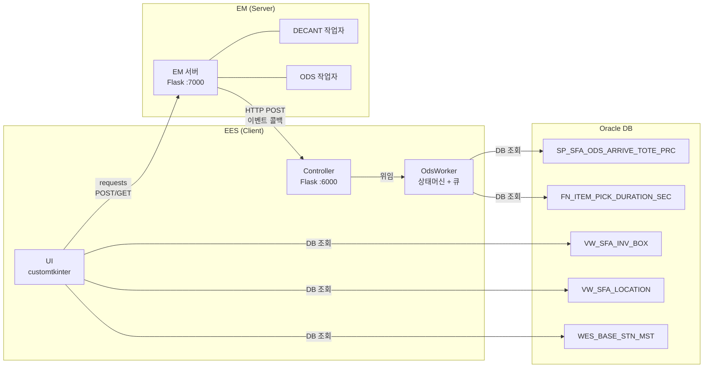

---

## 2. 작업 Phase 흐름

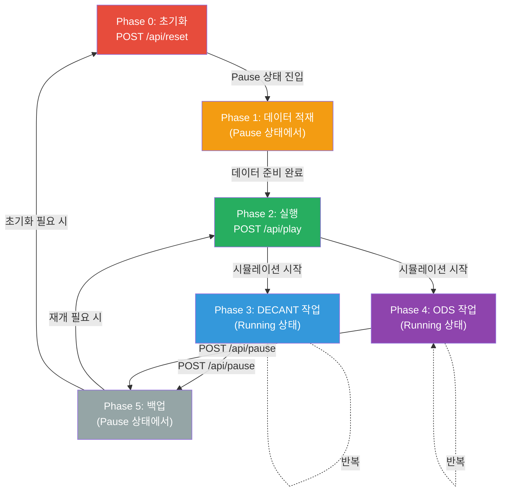

### Phase별 필요 상태

| Phase | 필요 상태 | 설명 |
|:---:|:---:|:---|
| 0 | - | 언제든 호출 가능 (단, Reset은 Pause 상태에서만 성공) |
| 1 | **Pause** | 데이터 적재는 일시정지 상태에서만 가능 |
| 2 | **Pause** | Play로 Running 전환 |
| 3~4 | **Running** | 실제 작업 수행 (DECANT, ODS 동시 진행) |
| 5 | **Pause** | 백업 조회는 일시정지 + 추가 안전 조건 필요 |

---

## 3. Phase 0~2: 초기화 → 데이터 적재 → 실행

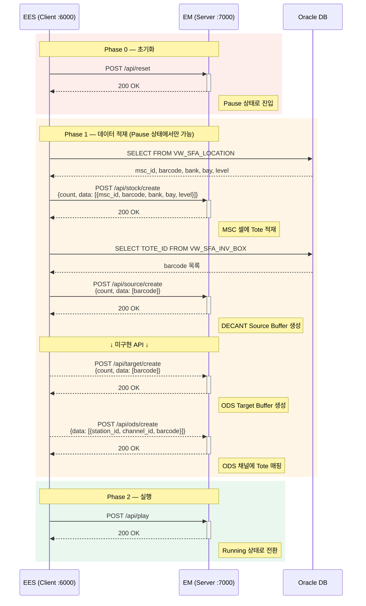

### Phase 1 API Request Body 상세

| API | Body |
|:---|:---|
| **Create Stock** | `{count: int, data: [{msc_id: str, barcode: str, bank: int, bay: int, level: int}]}` |
| **Create Source** | `{count: int, data: [barcode: str]}` |
| **Create Target** | `{count: int, data: [barcode: str]}` |
| **Create ODS** | `{data: [{station_id: str, channel_id: str, barcode: str}]}` |

### Phase 1 NG 조건 정리

| API | NG 조건 |
|:---|:---|
| Create Stock | Pause 아닌 경우, msc_id 미존재, barcode 중복, count!=data수, 복합키 중복, Cell 미존재 |
| Create Source | Pause 아닌 경우, 투입구 미지정, count!=data수, barcode 중복 |
| Create Target | Create Source와 동일 |
| Create ODS | channel에 Tote 있음, station_id 미존재, channel_id 미존재, barcode 중복, 복합키 중복 |

---

## 4. Phase 3: DECANT 작업 흐름

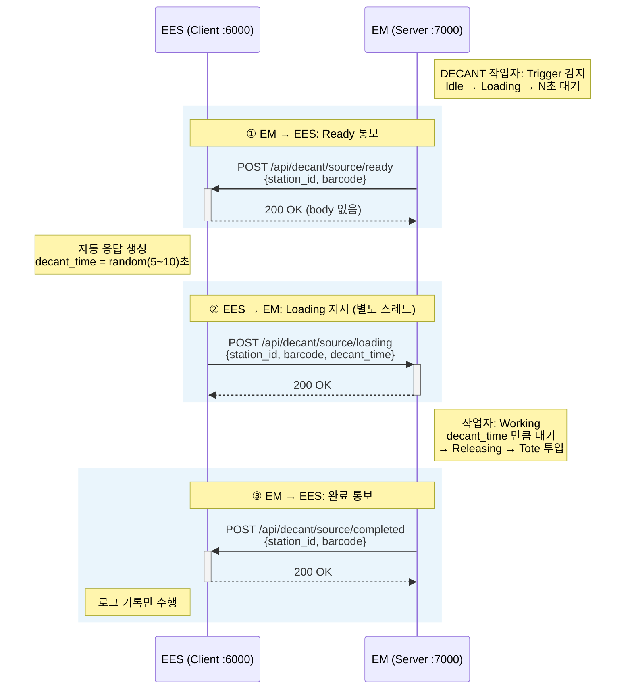

### DECANT 작업자 상태 머신

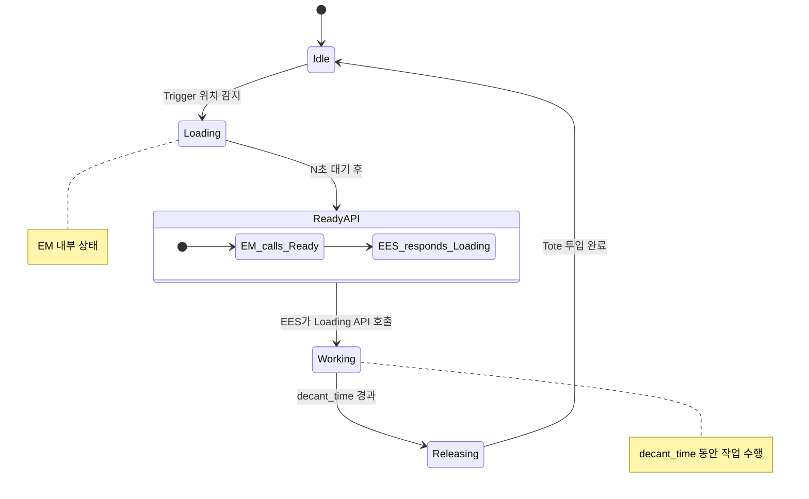

### DECANT Loading NG 조건

| 조건 | 설명 |
|:---|:---|
| 실행 상태 아닌 경우 | Running 상태에서만 호출 가능 |
| station_id 미존재 | 유효하지 않은 스테이션 |
| barcode 불일치 | Ready에서 보낸 barcode와 다름 |
| decant_time < 0 | 음수 시간 불가 |
| 작업자 상태 != Loading | 작업자가 Loading 대기 중이 아님 |

---

## 5. Phase 4-A: ODS Source Pickup (피킹)

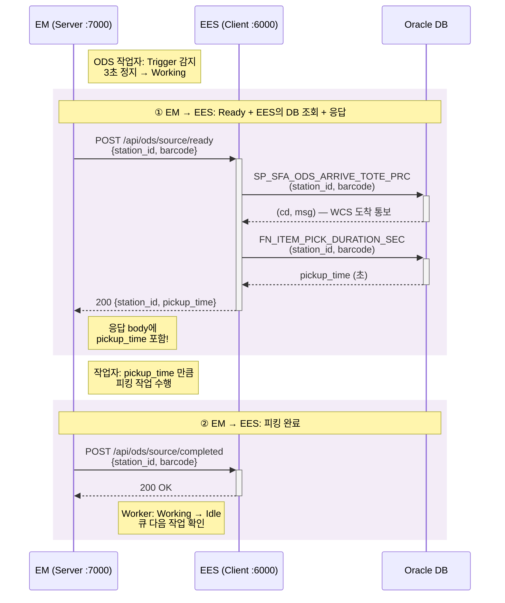

### ODS Source Ready 응답 형식

```json
// Request (EM → EES)
{ "station_id": "FST01", "barcode": "TOTE001" }

// Response (EES → EM) ← 반드시 body에 데이터 반환!
{ "station_id": "FST01", "pickup_time": 12.5 }
```

---

## 6. Phase 4-B: ODS Target Release (배출)

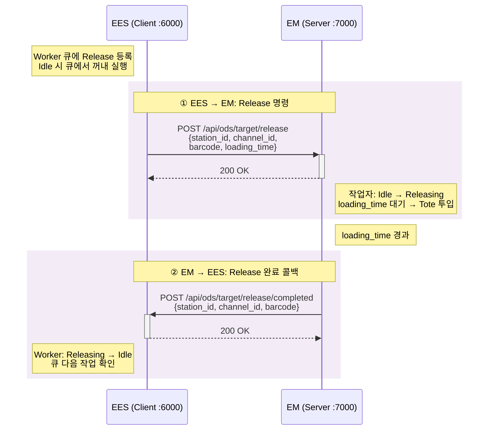

### Release NG 조건

| 조건 | 설명 |
|:---|:---|
| 실행 상태 아닌 경우 | Running 상태에서만 호출 가능 |
| station_id 미존재 | 유효하지 않은 스테이션 |
| channel_id 미존재 | 유효하지 않은 채널 |
| Tote 미매핑 | 해당 채널에 매핑된 Tote가 없음 |
| barcode 불일치 | 매핑된 Tote의 barcode와 다름 |
| loading_time < 0 | 음수 시간 불가 |

---

## 7. Phase 4-C: ODS Target Mapping (채널 매핑)

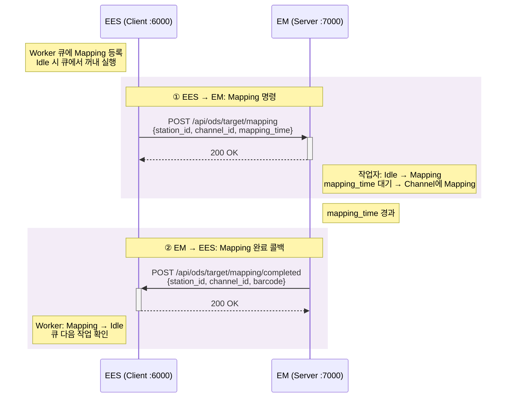

### Mapping NG 조건

| 조건 | 설명 |
|:---|:---|
| 실행 상태 아닌 경우 | Running 상태에서만 호출 가능 |
| station_id 미존재 | 유효하지 않은 스테이션 |
| channel_id 미존재 | 유효하지 않은 채널 |
| channel에 이미 Mapping됨 | 중복 매핑 불가 |
| mapping_time < 0 | 음수 시간 불가 |

---

## 8. Phase 5: 백업 조회

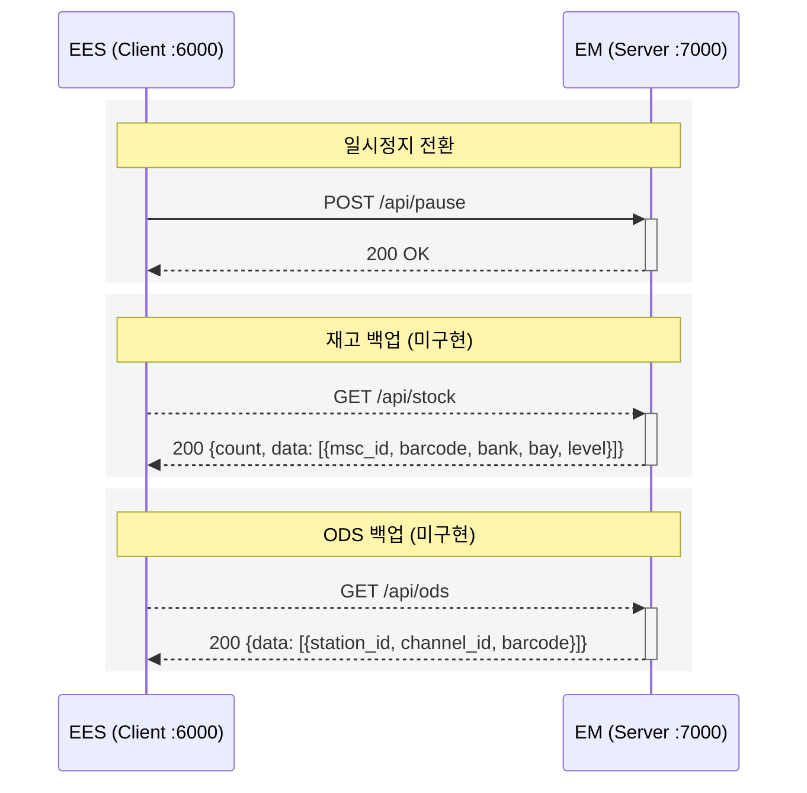

### 백업 NG 조건 (Stock / ODS 공통)

| 조건 | 설명 |
|:---|:---|
| 일시정지 아닌 경우 | Pause 상태에서만 조회 가능 |
| 프로젝트 내 Tote 존재 | 적재 상태 Tote 제외, 이동중 Tote가 있으면 불가 |
| MV가 Tote 적재중 | 운반차가 Tote를 들고 있으면 불가 |
| MV ID 미할당 | 운반차 ID가 할당되지 않은 상태 |
| MV 명령 수행중 | 운반차가 명령을 수행 중이면 불가 |

---

## 9. ODS Worker 상태 머신

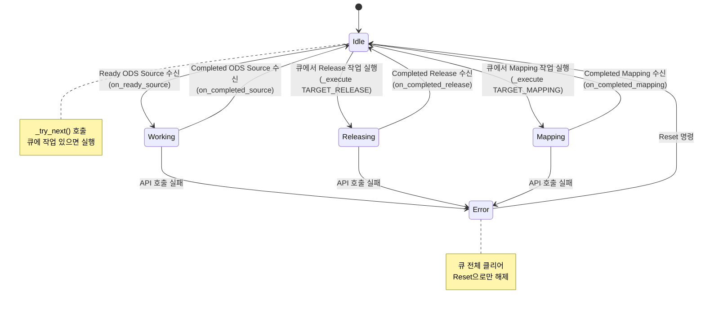

---

## 10. ODS Worker 큐 스케줄링

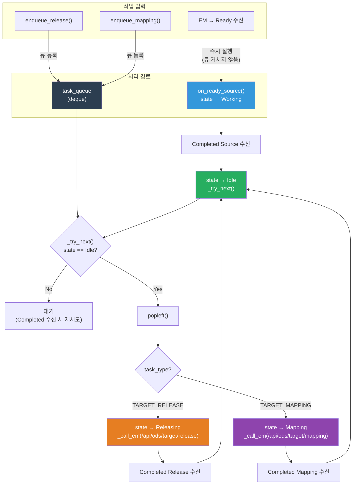

---

## 11. 전체 통합 시퀀스 (Happy Path)

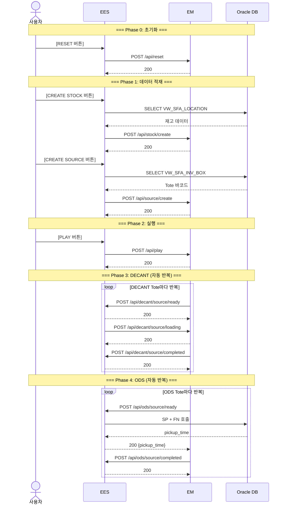

---

## 12. API 전체 요약

### EES → EM (12개)

| # | API | Method | Endpoint | Body | 구현 |
|:---:|:---|:---:|:---|:---|:---:|
| 1 | Play | POST | `/api/play` | - | ✅ |
| 2 | Pause | POST | `/api/pause` | - | ✅ |
| 3 | Reset | POST | `/api/reset` | - | ✅ |
| 4 | Create Stock | POST | `/api/stock/create` | `{count, data: [{msc_id, barcode, bank, bay, level}]}` | ✅ |
| 5 | Create Source Buffer | POST | `/api/source/create` | `{count, data: [barcode]}` | ✅ |
| 6 | Loading DECANT Source | POST | `/api/decant/source/loading` | `{station_id, barcode, decant_time}` | ✅ |
| 7 | Create Target Buffer | POST | `/api/target/create` | `{count, data: [barcode]}` | ❌ |
| 8 | Create ODS | POST | `/api/ods/create` | `{data: [{station_id, channel_id, barcode}]}` | ❌ |
| 9 | Backup Stock | GET | `/api/stock` | - | ❌ |
| 10 | Backup ODS | GET | `/api/ods` | - | ❌ |
| 11 | Release ODS Target | POST | `/api/ods/target/release` | `{station_id, channel_id, barcode, loading_time}` | ❌ |
| 12 | Mapping ODS Target | POST | `/api/ods/target/mapping` | `{station_id, channel_id, mapping_time}` | ❌ |

### EM → EES (5개)

| # | API | Method | Endpoint | Request Body | Response Body | 구현 |
|:---:|:---|:---:|:---|:---|:---|:---:|
| 1 | Ready DECANT Source | POST | `/api/decant/source/ready` | `{station_id, barcode}` | - | ✅ |
| 2 | Completed DECANT Source | POST | `/api/decant/source/completed` | `{station_id, barcode}` | - | ✅ |
| 3 | Ready ODS Source | POST | `/api/ods/source/ready` | `{station_id, barcode}` | **`{station_id, pickup_time}`** | ✅ |
| 4 | Completed ODS Source | POST | `/api/ods/source/completed` | `{station_id, barcode}` | - | ✅ |
| 5 | Completed Release ODS Target | POST | `/api/ods/target/release/completed` | `{station_id, channel_id, barcode}` | - | ✅ |
| 6 | Completed Mapping ODS Target | POST | `/api/ods/target/mapping/completed` | `{station_id, channel_id, barcode}` | - | ✅ |

### 구현 현황

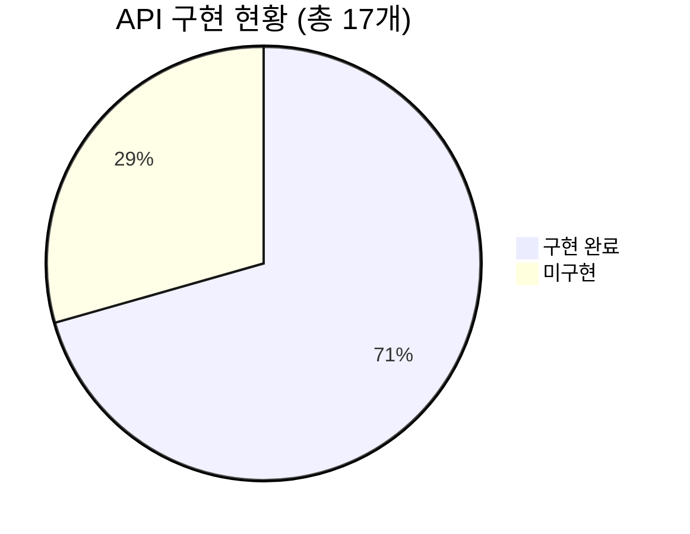

| 구분 | 구현 | 미구현 | 합계 |
|:---|:---:|:---:|:---:|
| EES → EM | 6 | 6 | 12 |
| EM → EES | 6 | 0 | 6 |
| **합계** | **12** | **6** | **18** |

---

## 13. 통신 패턴 분류

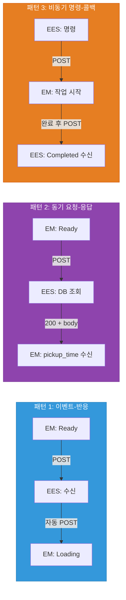

| 패턴 | 적용 대상 | 방향 | 특징 |
|:---|:---|:---:|:---|
| **이벤트-반응** | DECANT | EM→EES→EM | Ready 수신 후 EES가 자동으로 Loading 역호출 |
| **동기 요청-응답** | ODS Source Pickup | EM→EES | Ready의 HTTP 응답 body에 pickup_time 포함 |
| **비동기 명령-콜백** | ODS Release / Mapping | EES→EM→EES | 명령 후 EM이 작업 완료 시 Completed 콜백 |

---

## 14. 미구현 API 구현 로드맵

```mermaid
gantt
    title 미구현 API 구현 우선순위
    dateFormat X
    axisFormat %s

    section Phase 1 - 데이터 적재
    POST /api/target/create   :a1, 0, 1
    POST /api/ods/create      :a2, 0, 1

    section Phase 4 - ODS 작업
    POST /api/ods/target/release  :a3, 1, 2
    POST /api/ods/target/mapping  :a4, 1, 2

    section Phase 5 - 백업
    GET /api/stock            :a5, 2, 3
    GET /api/ods              :a6, 2, 3
```

| 우선순위 | API | Phase | 의존성 |
|:---:|:---|:---:|:---|
| 1 | `POST /api/target/create` | 1 | 없음 — ODS Target Buffer 생성 |
| 1 | `POST /api/ods/create` | 1 | 없음 — ODS 채널 사전 매핑 |
| 2 | `POST /api/ods/target/release` | 4 | Worker 큐에서 호출 (enqueue_release 연결 필요) |
| 2 | `POST /api/ods/target/mapping` | 4 | Worker 큐에서 호출 (enqueue_mapping 연결 필요) |
| 3 | `GET /api/stock` | 5 | 모든 Phase 4 작업 완료 후 |
| 3 | `GET /api/ods` | 5 | 모든 Phase 4 작업 완료 후 |

---

## 15. 공통 규칙

### HTTP 통신 규칙
- Content-Type: `application/json`
- 모든 속성은 필수, null/whitespace 불가
- 성공: HTTP 200 (body 없거나 데이터 포함)
- 실패: 상황별 상태코드 + `{"message": "실패 사유"}`

### 바코드 중복 검사
- 모든 생성 API(`create` 계열)에서 **등록된 바코드 전체**에 대해 수행
- Stock, Source, Target, ODS 모든 영역에서 교차 검사

### Error 상태 처리
- API 호출 실패 또는 잘못된 요청 시 Worker가 Error 상태 진입
- Error 상태에서는 신규 작업/큐 작업 모두 수행 불가
- 해제 조건: 시뮬레이션 초기화 (`POST /api/reset`)
